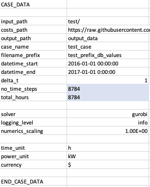
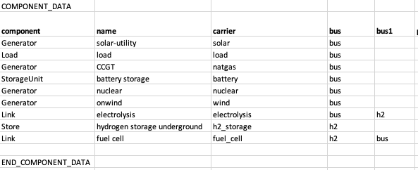

# Table input for PyPSA

### Build a PyPSA network from an Excel table, also suitable for users with little programming experience

This repository holds an interface for [PyPSA](https://github.com/PyPSA/pypsa) that allows to build a network from a table input (xlsx or csv) file. It is designed to be easy to use for users with little programming experience. It allows to build a network from a table input file and to optimize a PyPSA network with a single command without requiring detailed knowledge of the PyPSA syntax. Its limitations lie in the complexity of the network that can be built. For more complex networks, we recommend to use [PyPSA-Eur](https://github.com/PyPSA/pypsa-eur) or [PyPSA-Earth](https://github.com/pypsa-meets-earth/pypsa-earth).


## The table input file
The following information is read in from the input file (see `test/test_case.xlsx` for an example):
- **Case Data** holds general information about the setup like
    - input/output paths
    - time range
    - solver, logging level, numeric scale factor
    - units



- **Component Data** holds information about the components in the network and their attributes like
    - component type and name
    - bus(ses) connected to this component
    - capital and marginal costs
    - time series file names
    - other attributes like efficiency, max_hours, etc 



#
## Technology data

Costs and other technology inputs can be read in from the [PyPSA technology database](https://github.com/PyPSA/technology-data) or manually specified in the input file.
- To read values from the database, adjust the `costs_path` to the cost assumptions to be used (default is 2020 costs) and **choose the name of the technology exactly as in the database**. In the **cells that should be read from the database, enter "db"**. If this attribute does not exist in the database, this will cause an error. To multiply the database value by a factor, enter "*factor*\*db_*attr*", e.g. "3\*db_capital_cost". Empty cells default to PyPSA defaults.
- To manually define values, just enter the value in the input file. Use technology names that are different than those in the database to avoid confusion.
- Combinations of both are possible as well.

(See `test/test_case_db_values.xlsx` for an example)


#

# Installation

## Clone this repository 

with --recursive (this clones PyPSA as a submodule )

```git clone https://github.com/carnegie/clab_pypsa --recursive```

which creates a directory `clab_pypsa`, cd into that director with

```cd clab_pypsa``` 

#
## Install dependencies in the environment

When you're running for the first time, create a new environment based on the `env.yaml` file. We recommend using conda for easy package management.

If you're running for the first time, create the environment with

```conda env create -f env.yaml```

Then activate the environment with

```conda activate pypsa_table```

**every time** you want this code.

#
## Install a solver

For using Gurobi, the installation is already included in the environment but you still need to [obtain and activate a license](https://www.gurobi.com/documentation/9.5/quickstart_windows/retrieving_and_setting_up_.html). Free licenses for academics are available.

For other solvers, see the installation instructions in the [PyPSA documentation](https://pypsa.readthedocs.io/en/latest/installation.html).

#
## Run PyPSA

To run PyPSA, you need to have a case input file and data input files.

pyPSA is run with the command

```python run_pypsa.py -f <input_file>```

where `<input_file>` is the case input file, e.g.

```python run_pypsa.py -f test/test_case.xlsx``` 

Note: If you run into a problem executing the code, try running within a 'bash' shell. 

#
#
## Create a new project based on clab_pypsa

To add `clab_pypsa` as a submodule in a new repository do

```git submodule add -b main https://github.com/carnegie/clab_pypsa```

Make sure to update the submodule regularly by doing

```git submodule update --remote --recursive```

To run PyPSA in that repository, then run

```python clab_pypsa/run_pypsa.py -f <path_to_your_case_file>```


#

[](https://www.doi.org/10.5281/zenodo.10085173)

